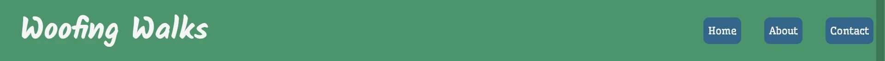
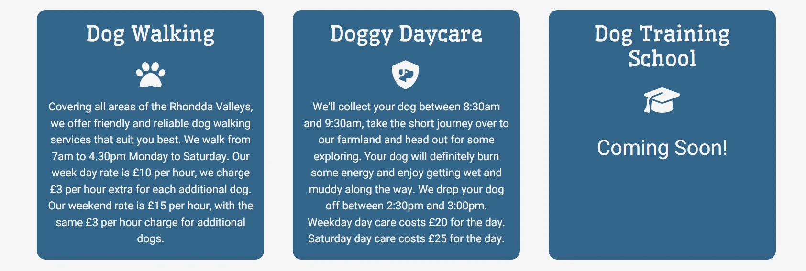
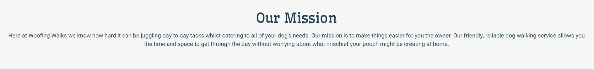
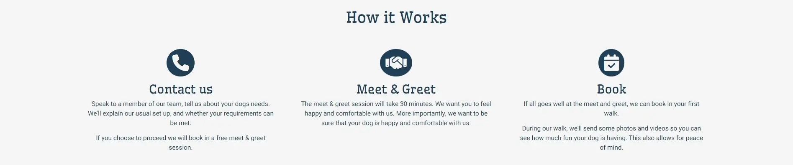

# 
**Woofing Walks**

[View the Woofing Walks live website here](https://abz2489.github.io/woofing-walks/)

Woofing Walks is a dog walking service based in the Rhondda Valleys. The aim of the website is to promote Woofing Walks' services and attract new customers to the business. Woofing Walks is aimed at dog owners looking for trusted dog walkers in their local area. 
The website provides information of what new customers can expect from their services. It also includes walk times, prices & contact information.

______________
## **User Experience (UX)**
### **User Stories**

#### **First Time Visitor Goals**
- I need to quickly identify what Woofing Walks is.
- I need to easily navigate the Woofing Walks website so I can find information on Woofing Walks' services.
- I need to find pricing information of Woofing Walks' services.

#### **Returning Visitor Goals**
- I need to easily find contact information so I can book a walk or ask more questions.
- I need to easily access Woofing Walks' social media so I can follow.

#### **Frequent Visitor Goals**
- I need to find information on new services Woofing Walks offer.

## **Design**
### **Colour Scheme**
### **Typography**

Google Fonts was used for all fonts on the website
- Kalam is used for the nav brand only, it's a handwriting font with a personal feel.
- Wellfleet is used as a stand out for all headings and buttons on the website. Wellfleet is a slab-serif font.
- Heebo is used for larger bodies of text to ensure ease of reading for the user. It's a sans-serif font.

### Wireframes

-------------------------------------
## **Features**

### **Existing Features**

#### **Home Page**
- **F01 Navigation Bar:** The nav bar looks the save across all pages. The nav brand is a simple font and when clicked will take users back to the index page from all pages. The nav includes three links; Home, About and Contact. All three have been styled to stand out as buttons. All links are functioning and when clicked will take the user to the correct pages.

- **F02 Hero Image & Call to Action:** The Hero Image fills the width of the page across all devices and includes a banner below with a call to action button "more info". When pressed the button takes the user to the about page where they can learn more about Woofing Walks' services.

- **F03 Services Summary Section:** The services summary section gives a brief summary of what services Woofing Walks offer. The last block includes a future service pending with a "Coming Soon" caption to pique interest in the Dog Training School and encourage return visitors.

- **F04 Footer:** The footer is uniform across all three pages. The footer includes three social media links consisting of logos. All links open a new tab and take the user to the relevant social media page.

#### **About Page**
- **F05 Our Story Section:** Our Story section introduces Woofing Walks' owner, Sarah and summarises the background of the company. It includes a picture of a dog on a walk at the bottom.

- **F06 Our Mission:** Our Mission section is a small section including the mission statemnt and horizantal rule before the next section.

- **F07 How it Works Section:** How it works sections consists of three stages summarising what the user needs to do next and what will happen before we register their dog for dog walking

### **Future Features**
1. In the future, I plan to add a gallery page.
2. In the future, I intend to introduce a FAQ section.

-------------------------------------
## Technologies Used

### Languages Used
- HTML5
- CSS3

### Frameworks, Libraries & Programs used
- Balsamiq
- Git
- GitHub
- Bootstrap 5.3
- Font Awesome
- Google Fonts

-------------------------------------
## **Testing**
### **W3C Validator Testing**
[Index Page HTML](https://github.com/abz2489/woofing-walks/blob/main/docs/readme/testing/w3c/w3cindex.png)
### **User Story Testing**
### Solved Bugs
1. Footer cuts off bottom content on mobile devices in chrome browser. Content cut off fixed by switching from fixed-bottom to sticky-bottom. 

2. W3C validator showed error with nav buttons including a tags. I fixed this by removing the button tag, adding a button class and styling the button using CSS. Fixing this error affected my "more info" button in my hero image section. This was easily fixed by adding the button class previously used.

3. Whitespace showing to the right of index page. I used Chrome dev tools and found that the bootstrap row class was adding unwanted gutter. I removed this by using g-0 class alongside the row class.

4. Contact Form page has whitespace to the right. Using dev tools, I could see that one of my row divs was causing the issue, but wasn't sure which one. I added background-color: red to one div and background-color: blue to another to identify. I then added margin:auto to the problem div in CSS.

5. Nav buttons are showing too large on medium screens (768px) on the Index Page and Contact Page. Bug fixed by removing larger font size in the 768px media query.

6. Image in the Our Story section distorted. Changed the original image to square, using windows. Coverted the image to Webp and replaced existing image to fix the bug.

7. Overlay is floating upwards when changing screen sizes for larger screens. Issue was fixed by adding bottom:0 to cta-container, it now sits flush to the bottom of the hero image.

8. Fixing the overlay bug caused the container to be in a fixed position on mobile and tablet devices. Dev tools was used to find the declaration causing the issue, position:fixed. By removing this the bug is fixed and the container sits directly beneath the hero image as intended.

### Unfixed Bugs

-------------------------------------
## **Deployment**

Woofing Walks' live website was deployed using GitHub Pages.

**Deployment Instructions:**
1. Sign in to [GitHub](https://github.com/login) or [Sign Up](https://github.com/signup?ref_cta=Sign+up&ref_loc=header+logged+out&ref_page=%2F&source=header-home) for an account.
2. Find the [woofing-walks](https://github.com/abz2489/woofing-walks) repository.
3. Click settings.
4. Click the Pages link, found on the left hand navigation bar.
5. In the Build and Deployment section select the main branch and root folder.
6. Click Save, the live website is now deployed.

-------------------------------------
## **Credits**

https://www.joshwcomeau.com/animation/css-transitions/ - His article helped me with my transitions.
### Content
### Media

All images for Woofing Walks were sourced from [Pexels](https://www.pexels.com).
#### Index Page
-[Hero Image](https://www.pexels.com/photo/two-adult-harrier-dogs-standing-beside-river-1144410/)

-[About Page, Our Story section](https://www.pexels.com/photo/english-cocker-spaniel-puppy-sitting-on-ground-beside-grass-1254140/)

https://www.pexels.com/photo/two-adult-black-and-tan-german-shepherds-running-on-ground-1633522/
https://www.pexels.com/photo/a-dog-biting-a-branch-12729351/

-------------------------------------

