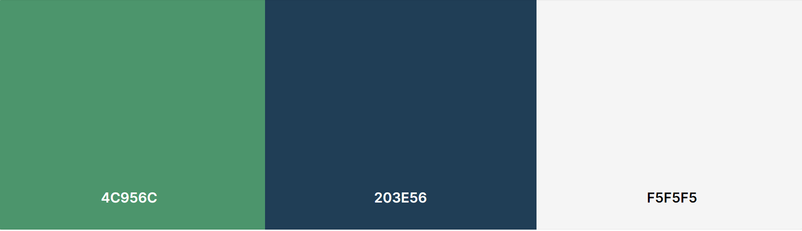

# 
**Woofing Walks**

[View the Woofing Walks live website here](https://abz2489.github.io/woofing-walks/)

Woofing Walks is a dog walking service based in the Rhondda Valleys. The aim of the website is to promote Woofing Walks' services and attract new customers to the business. Woofing Walks is aimed at dog owners looking for trusted dog walkers in their local area. 
The website provides information of what new customers can expect from their services. It also includes walk times, prices & contact information.

# **User Experience (UX)**
## **User Stories**

### **First Time Visitor Goals**
- I need to quickly identify what Woofing Walks is.
- I need to easily navigate the Woofing Walks website so I can find information on Woofing Walks' services.
- I need to find pricing information of Woofing Walks' services.

### **Returning Visitor Goals**
- I need to easily find contact information so I can book a walk or ask more questions.
- I need to easily access Woofing Walks' social media so I can follow.

### **Frequent Visitor Goals**
- I need to find information on new services Woofing Walks offer.

# **Design**
## **Colour Scheme**

## **Typography**
Google Fonts was used for all fonts on the website
- Kalam is used for the nav brand only, it's a handwriting font with a personal feel.
- Wellfleet is used as a stand out for all headings and buttons on the website. Wellfleet is a slab-serif font.
- Heebo is used for larger bodies of text to ensure ease of reading for the user. It's a sans-serif font.

## **Wireframes**
### **Home Page**

Mobile

Desktop

The Homepage design stayed the same, with the addition of a page title that displays underneath the hero image on mobile devices and as an overlay on larger screens. The title tells the user instantly what the website is and where the services are offered.

### **About Page**

Mobile

Desktop

The "Why choose us?" section was changed to "Our Mission". I didn't want two lists at the bottom of the about page. The "How it works" sections made more sense as it explains the next steps clearly to potential new customers.

### **Contact Page**

Mobile

Desktop

The contact details were moved to the top of the page to ensure that they're found easily. The option to sign up for a newsletter didn't quite coincide with the need to attract new business. Having a simple online form to capture basic details of the customer and their dog is a much more effective way to onboard new customers.

# **Features**

## **Existing Features**

### **Home Page**

F01 Navigation Bar

The nav bar looks the save across all pages. The nav brand is a simple font and when clicked will take users back to the index page from all pages. The nav includes three links; Home, About and Contact. All three have been styled to stand out as buttons. All links are functioning and when clicked will take the user to the correct pages.

F02 Hero Image & Call to Action

The Hero Image fills the width of the page across all devices and includes a banner below with a call to action button "more info". When pressed the button takes the user to the about page where they can learn more about Woofing Walks' services.

F03 Services Summary Section
 
The services summary section gives a brief summary of what services Woofing Walks offer. The last block includes a future service pending with a "Coming Soon" caption to pique interest in the Dog Training School and encourage return visitors.

F04 Footer
 
The footer is uniform across all three pages. The footer includes three social media links consisting of logos. All links open a new tab and take the user to the relevant social media page.

### **About Page**

F05 Our Story Section

 Our Story section introduces Woofing Walks' owner, Sarah and summarises the background of the company. It includes a picture of a dog on a walk at the bottom.

F06 Our Mission
 
Our Mission section is a small section including the mission statemnt and horizantal rule before the next section.

F07 How it Works Section
 
How it works sections consists of three stages summarising what the user needs to do next and what will happen before we register their dog for dog walking.

### **Contact Page**

F08 Contact Information Section
 
The contact information is placed at the top of the page so it's the first thing the user sees when contact page loads.

F09 Contact Form Section
 
The contact form collects the dog owner's information and basic information for the dog. There's an additional info box for the user to add anything specific that Woofing Walks might need to know.

F10 Thank You Page
 
When the user successfully completes the contact form, they will be taken to the thank you page. The thank you page will redirect back to the home page within 5 seconds. If the redirect fails, there is a home button displayed as a back up.

### **Future Features**
1. In the future, I plan to add a gallery page.
2. In the future, I intend to introduce a FAQ section.

# Technologies Used

## Languages Used
[HTML5,](https://en.wikipedia.org/wiki/HTML5)

[CSS3,](https://en.wikipedia.org/wiki/CSS)

## Frameworks, Libraries & Programs used
[Balsamiq,](https://balsamiq.com/) used to create the wireframes at the beginning of the design process.

[Git,](https://git-scm.com/) used for version control. I used the terminal and git commit/push commands and the source control panel.

[GitHub,](https://github.com/) used as storage for the Woofing Walks repository.

[Bootstrap 5.3,](https://getbootstrap.com/) used for responsive layout, some bootstrap styles were customised in the css stylesheet for the project.

[Font Awesome,](https://fontawesome.com/) used to import icons to the home page and about page for UX purposes.

[Google Fonts,](https://fonts.google.com/) used to import all fonts used on the website.

[Fonticon,](https://gauger.io/fonticon/) used to create favicon.

# **Testing**

## **Responsiveness**

## **Browser Compatibility**

## **Solved Bugs**
1. Footer cuts off bottom content on mobile devices in chrome browser. Content cut off fixed by switching from fixed-bottom to sticky-bottom. 

2. W3C validator showed error with nav buttons including a tags. I fixed this by removing the button tag, adding a button class and styling the button using CSS. Fixing this error affected my "more info" button in my hero image section. This was easily fixed by adding the button class previously used.

3. Whitespace showing to the right of index page. I used Chrome dev tools and found that the bootstrap row class was adding unwanted gutter. I removed this by using g-0 class alongside the row class.

4. Contact Form page has whitespace to the right. Using dev tools, I could see that one of my row divs was causing the issue, but wasn't sure which one. I added background-color: red to one div and background-color: blue to another to identify. I then added margin:auto to the problem div in CSS.

5. Nav buttons are showing too large on medium screens (768px) on the Index Page and Contact Page. Bug fixed by removing larger font size in the 768px media query.

6. Image in the Our Story section distorted. Changed the original image to square, using windows. Coverted the image to Webp and replaced existing image to fix the bug.

7. Overlay is floating upwards when changing screen sizes for larger screens. Issue was fixed by adding bottom:0 to cta-container, it now sits flush to the bottom of the hero image.

8. Fixing the overlay bug caused the container to be in a fixed position on mobile and tablet devices. Dev tools was used to find the declaration causing the issue, position:fixed. By removing this the bug is fixed and the container sits directly beneath the hero image as intended.

9. Contact form showed 405 error page when submitted. Bug fixed by removing method="POST" attribute from form tag.
## **Unfixed Bugs**

## **W3C Validator Testing**
### **Index Page** 

The first HTML validation test flagged a services ID used multiple times. This was removed to fix the errors.

The second HTML validation showed no errors.

### **About Page**

The first HTML validation test flagged bottom scripts sitting outside the closing body tag. The scripts were cut and pasted inside the body tags at the very bottom to fix the error.

The second HTML validation showed no errors.

### **Contact Page**

The first HTML validation test flagged three errors. There was a stray closing script tag, removed to fix. A for attribute was used on a select element, removed to fix. Missing multiple attribute from the drop down to select a service (line 87), added the multiple attribute to fix the error.

The second HTML validation showed no errors.

### **Thank you Page**

The first HTML validation flagged a trailing slash at the end of the img tag. This was removed.

The second HTML validation showed no errors.

### **CSS**

The CSS validator showed no errors.

## **Lighthouse Testing**
### **Index Page Mobile Testing**

Click here

First Test:

Final Test:

- **SEO:** Score increased to 100 by adding meta description tags to the head and changing link text on the cta button to About Us.
- **Accessibility:** Score inscreased to 100 by adding aria-label to all a tags.
- **Performance:** Performance was increased to 72 in incognito mode.

### **Index Page Desktop Testing:**

Click here

First Test:

### **About Page Mobile Testing:**

Click here

First Test:

### **About Page Desktop Testing:**

Click here

First Test:

### **Contact Page Mobile Testing:**

Click here

First Test:

### **Contact Page Desktop Testing:**

Click here

First Test:

### **Thank You Page Mobile Testing:**

Click here

First Test:

### **Thank You Page Desktop Testing:**

Click here

First Test:

## **User Story Testing**
**First Time Visitor Goals**

1. I need to quickly identify what Woofing Walks is and where they are based.
- The Home Page displays a "Dog Walking Services" title along with the area the services are offered. This is immediately visible when the home page loads and requires no scrolling to see.
2. I need to easily navigate the Woofing Walks website so I can find information on Woofing Walks' services.
- The navigation bar has clearly defined buttons for each page. The about page is accessible from the nav bar and the call to action "About Us" button in the hero image overlay.
3. I need to find pricing information of Woofing Walks' services.
- The price of Woofing Walks' services is included in the services summary section on the home page.

**Returning Visitor Goals**

4. I need to easily find contact information so I can book a walk or ask more questions.
- The contact button is clearly defined in the navigation bar on all pages. The contact information for Woofing Walks is displayed at the very top of the contact page and is the first thing the user will see.
5. I need to easily access Woofing Walks' social media so I can follow.
- Social links are located in the footer of each page and open in a new tab when clicked.

**Frequent Visitor Goals**

6. I need to find information on other services Woofing Walks offer.
- The services summary section of the Home Page includes information on doggy day care service. This section also promotes intrigue by showing that dog training school is coming soon.

### Solved Bugs
1. Footer cuts off bottom content on mobile devices in chrome browser. Content cut off fixed by switching from fixed-bottom to sticky-bottom. 

2. W3C validator showed error with nav buttons including a tags. I fixed this by removing the button tag, adding a button class and styling the button using CSS. Fixing this error affected my "more info" button in my hero image section. This was easily fixed by adding the button class previously used.

3. Whitespace showing to the right of index page. I used Chrome dev tools and found that the bootstrap row class was adding unwanted gutter. I removed this by using g-0 class alongside the row class.

4. Contact Form page has whitespace to the right. Using dev tools, I could see that one of my row divs was causing the issue, but wasn't sure which one. I added background-color: red to one div and background-color: blue to another to identify. I then added margin:auto to the problem div in CSS.

5. Nav buttons are showing too large on medium screens (768px) on the Index Page and Contact Page. Bug fixed by removing larger font size in the 768px media query.

6. Image in the Our Story section distorted. Changed the original image to square, using windows. Coverted the image to Webp and replaced existing image to fix the bug.

7. Overlay is floating upwards when changing screen sizes for larger screens. Issue was fixed by adding bottom:0 to cta-container, it now sits flush to the bottom of the hero image.

8. Fixing the overlay bug caused the container to be in a fixed position on mobile and tablet devices. Dev tools was used to find the declaration causing the issue, position:fixed. By removing this the bug is fixed and the container sits directly beneath the hero image as intended.

9. More info button wasn't opening the about page when clicked. Bug fixed by changing the button tag to  tag.

10. Contact form showed 405 error page when submitted. Bug fixed by removing method="POST" attribute from form tag.
## Unfixed Bugs

# **Deployment**
Woofing Walks' live website was deployed using GitHub Pages.

## **Local Deployment**

### **How to Fork**
1. Go to GitHub repository.
2. In the top right of the screen, click the fork button.
3. A form will appear, you can edit the name and description or keep it the same.
4. Click the green Create Fork button.

### **How to Clone**
1. In the GitHub respository click the green Code button, that sits above the repository files.
2. When the dropdown appears choose from HTTP, SSH or GitHub CLI.
3. Click the copy button to the right of the URL to copy to your clipboard.
4. Open Git Bash / terminal, choose where you want to clone the files.
5. Type git clone and the following into the terminal https://github.com/abz2489/woofing-walks.git
6. Press enter to create the clone.

## **Remote Deployment**
1. Sign in to [GitHub](https://github.com/login) or [Sign Up](https://github.com/signup?ref_cta=Sign+up&ref_loc=header+logged+out&ref_page=%2F&source=header-home) for an account.
2. Find the [woofing-walks](https://github.com/abz2489/woofing-walks) repository.
3. Click settings.
4. Click the Pages link, found on the left hand navigation bar.
5. In the Build and Deployment section select the main branch and root folder.
6. Click Save, the live website is now deployed.

# **Credits**

https://www.joshwcomeau.com/animation/css-transitions/ - This article helped me with my nav brand transition.
https://blog.hubspot.com/website/html-redirect
## Content
## Media

All images for Woofing Walks were sourced from [Pexels](https://www.pexels.com).
### Index Page
-[Hero Image](https://www.pexels.com/photo/two-adult-harrier-dogs-standing-beside-river-1144410/)

### About Page
-[Our Story section Image](https://www.pexels.com/photo/english-cocker-spaniel-puppy-sitting-on-ground-beside-grass-1254140/)

-[Our Mission Section Image](https://www.pexels.com/photo/adorable-puppy-with-opened-mouth-4731108/)

### Thank You Page
-[Thank You Image](https://www.pexels.com/photo/cute-dogs-lying-on-the-porch-with-a-laptop-notebook-and-pen-9040620/)

-------------------------------------

